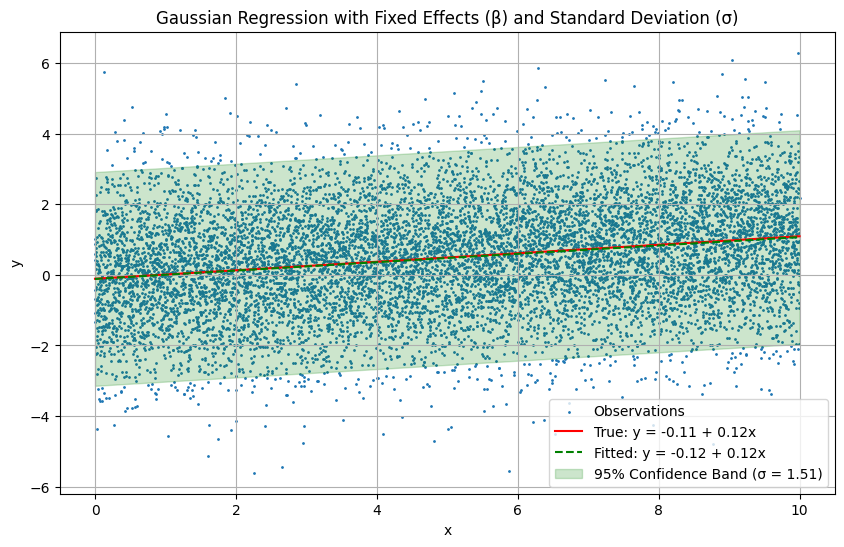
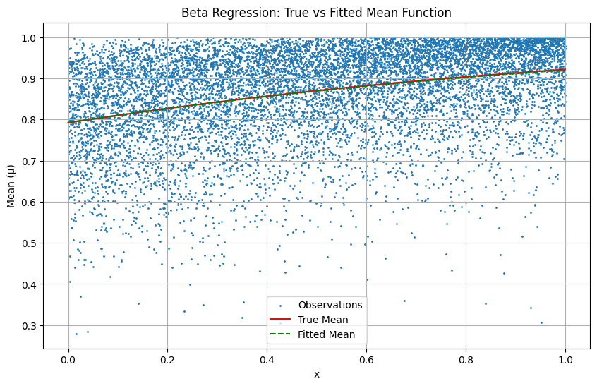

# pytorch-models

A collection of models implemented in PyTorch.

## Table of Contents
- [Gaussian Regression](#gaussian-regression)
- [Beta Regression](#beta-regression)

## Gaussian Regression

Gaussian regression uses a likelihood based on the Gaussian distribution.

The model that we'll fit is:

\quad\text{for } i=1,\dots,N,\\\mu_{i}&=\boldsymbol{x}_{i}^{\top}\boldsymbol{\beta}\end{aligned})

where 

* $y_{i}$ is the response of the $i\textrm{th}$ observation.
* $\boldsymbol{x}_{i}$ is the vector of covariate values for the $i\textrm{th}$ observation.
* $\boldsymbol{\beta}$ is the vector of effects for the fixed covariates.

The probability density function of the Gaussian distribution is:

$$
\begin{align*}
f(y_{i}; \mu_{i}, \sigma) &= \frac{1}{\sigma\sqrt{2\pi}}\exp\left( -\frac{1}{2\sigma^{2}} (y_{i}-\boldsymbol{x}_{i}^{\top} \boldsymbol{\beta})^2 \right)
\end{align*}
$$

Thus, the likelihood is 

$$
\begin{align*}
L(\mu_{i}, \sigma; y_{i}) &= \prod_{i=1}^{N} \sigma^{-1} (2\pi)^{-0.5}\exp\left( -\frac{1}{2\sigma^{2}} (y_{i}-\boldsymbol{x}_{i}^{\top} \boldsymbol{\beta})^2 \right)
\end{align*}
$$

The log-likelihood is 

$$
\begin{align*}
\textrm{log}(L(\mu_{i}, \sigma; y_{i})) &= \sum_{i=1}^{N}\textrm{log} \left[ \sigma^{-1} (2\pi)^{-0.5}\exp\left( -\frac{1}{2\sigma^{2}} (y_{i}-\boldsymbol{x}_{i}^{\top} \boldsymbol{\beta})^2 \right) \right] \\
&= - \sum_{i=1}^{N}\left[ \textrm{log}(\sigma) + 0.5 \textrm{log}(2\pi) + \frac{1}{2\sigma^{2}} (y_{i}-\boldsymbol{x}_{i}^{\top} \boldsymbol{\beta})^2 \right]
\end{align*}
$$

The negative log-likelihood is 

$$
\begin{align*}
-\textrm{log}(L(\mu_{i}, \sigma; y_{i})) &= \sum_{i=1}^{N}\left[ \textrm{log}(\sigma) + 0.5 \textrm{log}(2\pi) + \frac{1}{2\sigma^{2}} (y_{i}-\boldsymbol{x}_{i}^{\top} \boldsymbol{\beta})^2 \right]
\end{align*}
$$

Below is an example of PyTorch results for a Gaussian regression with 1 covariate.

## Beta Regression

Beta regression uses a likelihood based on the Beta distribution, which is ideal for modeling variables constrained to the (0,1) interval like proportions, rates, and probabilities.

The model that we'll fit is based on Ferrari and Cribari-Neto (2004):

$$
\begin{align*}
y_{i} &\sim \textrm{Beta}(p_{i}, q_{i}) ~~~ \textrm{for}~ i=1, ..., N, \\
p_{i} &=\mu_{i}\phi, \\
q_{i} &=(1-\mu_{i})\phi, \\
\textrm{Logit}(\mu_{i}) &= \boldsymbol{x}_{i}^{\top} \boldsymbol{\beta}, 
\end{align*}
$$

where 

* $y_{i} \in (0, 1)$ is the response of the $i\textrm{th}$ observation.
* $\boldsymbol{x}_{i}$ is the vector of covariate values for the $i\textrm{th}$ observation.
* $\boldsymbol{\beta}$ is the vector of effects for the fixed covariates.

The probability density function of the Beta distribution is:

$$
\begin{align*}
f(y_{i}; p_{i}, q_{i}) &= \frac{\Gamma(p_{i}+q_{i})}{\Gamma(p_{i})\Gamma(q_{i})} y_{i}^{p_{i}-1}(1-y_{i})^{q_{i}-1} \\
&= \frac{\Gamma(\phi)}{\Gamma(\mu_{i}\phi)\Gamma((1-\mu_{i})\phi)} y_{i}^{\mu_{i}\phi-1}(1-y_{i})^{(1-\mu_{i})\phi-1}
\end{align*}
$$

Thus, the likelihood is 

$$
\begin{align*}
L(p_{i}, q_{i}; y_{i}) &= \prod_{i=1}^{N}\frac{\Gamma(\phi)}{\Gamma(\mu_{i}\phi)\Gamma((1-\mu_{i})\phi)} y_{i}^{\mu_{i}\phi-1}(1-y_{i})^{(1-\mu_{i})\phi-1} \\
&= \prod_{i=1}^{N}\Gamma(\phi)\Gamma(\mu_{i}\phi)^{-1}\Gamma((1-\mu_{i})\phi)^{-1} y_{i}^{\mu_{i}\phi-1}(1-y_{i})^{(1-\mu_{i})\phi-1}
\end{align*}
$$

The log-likelihood is 

$$
\begin{align*}
\textrm{log}(L(p_{i}, q_{i}; y_{i})) &= \sum_{i=1}^{N}\textrm{log} \bigg[ \Gamma(\phi)\Gamma(\mu_{i}\phi)^{-1}\Gamma((1-\mu_{i})\phi)^{-1} y_{i}^{\mu_{i}\phi-1}(1-y_{i})^{(1-\mu_{i})\phi-1} \bigg] \\
&= \sum_{i=1}^{N} \big[ \textrm{log}(\Gamma(\phi)) - \textrm{log}(\Gamma(\mu_{i}\phi)) - \textrm{log}(\Gamma((1-\mu_{i})\phi)) \\
&+ (\mu_{i}\phi-1)\textrm{log}(y_{i}) + ((1-\mu_{i})\phi-1) \textrm{log}(1-y_{i}) \big]
\end{align*}
$$

The negative log-likelihood is 

$$
\begin{align*}
-\textrm{log}(L(p_{i}, q_{i}; y_{i})) &= -\sum_{i=1}^{N} \big[ \textrm{log}(\Gamma(\phi)) - \textrm{log}(\Gamma(\mu_{i}\phi)) - \textrm{log}(\Gamma((1-\mu_{i})\phi)) \\
&+ (\mu_{i}\phi-1)\textrm{log}(y_{i}) + ((1-\mu_{i})\phi-1) \textrm{log}(1-y_{i}) \big]
\end{align*}
$$

Below is an example of PyTorch results for a Beta regression with 1 covariate.

