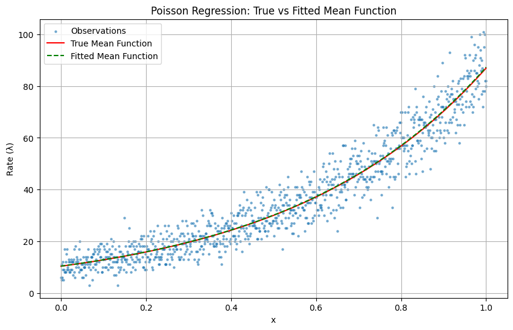

# pytorch-models

A collection of models implemented in PyTorch.

## Table of Contents
- [Gaussian Regression](#gaussian-regression)
- [Poisson Regression](#poisson-regression)
- [Logistic Regression](#logistic-regression)
- [Beta Regression](#beta-regression)
- [GAM Gaussian Regression](#gam-gaussian-regression)

## Gaussian Regression

Below is an example of PyTorch results for a Gaussian regression with 1 covariate.

## Poisson Regression

Below is an example of PyTorch results for a Poisson regression with 1 covariate.

## Logistic Regression

## Beta Regression

Below is an example of PyTorch results for a Beta regression with 1 covariate.

## GAM Gaussian Regression

Below is an example of PyTorch results with 1 covariate.

